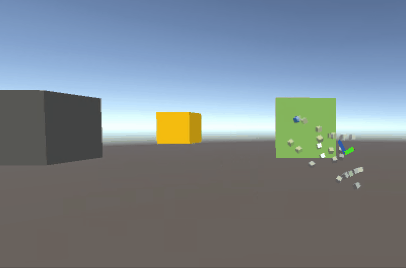

# MRTK Tips
This repository contains tips for using [MRTK](http://aka.ms/mrtk), mostly from answering stackoverflow questions and sharing [#mrtktips examples on Twitter](https://twitter.com/search?q=%23mrtktips&src=typed_query).

## Setup
1. These examples mostly use Unity. Install the latest version of Unity 2019.
2. Clone this repository, then open the projects under unity/MRTKTipsUnity2019

> Note: I also provide some unity packages, under unity/unitypackages. These do not contain mrtk files. Feel free to import these packages instead of cloning the project.

## Unity Examples
All examples use an unmodified version of [MRTK 2.0 release](https://github.com/microsoft/MixedRealityToolkit-Unity/releases/tag/v2.0.0)

### Clone Objects on Grab

From [this twitter post](https://twitter.com/julenka/status/1170449944697683968). Demonstrates how to clone objects on grab.
[Location](https://github.com/julenka/mrtk-tips/blob/master/unity/MRTKTipsUnity2019/Assets/MRTKTips/Scenes/CloneOnGrab.unity)
